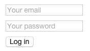

Forms are the cornerstone of any real app. In Angular 2, forms have changed quite a bit from their v1 counterpart.

Where we used to use `ngModel` and map to our internal data model, in Angular 2 we more explicitly build forms and form controls.

While it feels like more code to write, in practice it's easier to reason about than with v1, and we no longer
have to deal with frustrating ngModel and scope data problems.

## Simple Form

Let's start with a simple login form in HTML with Angular 2:

```html
<form (^submit)="doLogin($event)" [control-group]="loginForm">
  <div>
    <input control="email" type="email" placeholder="Your email">
  </div>
  <div>
    <input control="password" type="email" placeholder="Your email">
  </div>
  <button type="submit">Log in</button>
</form>
```

And the corresponding component JS:

```javascript

import {Component, Template, Parent} from 'angular2/angular2'
import {FormBuilder, Validators, FormDirectives, ControlGroup} from 'angular2/forms';

@Component({
  selector: 'login-page'
})
@Template({
  url: 'pages/login.html',
  directives: [View, FormDirectives]
})
export class LoginPage {
  constructor() {
    var fb = new FormBuilder()

    this.loginForm = fb.group({
      email: ['', Validators.required],
      password: ['', Validators.required],
    });
  }

  doLogin(event) {
    // Show the value of the form
    console.log(this.loginForm.value);

    event.preventDefault();
  }
}

```

When we run this, we are shown a simple login form with email and password:



## FormBuilder

The FormBuilder from the example above makes it easy for us to specify form controls and the various
validators we might want to apply to certain controls.

In the example above, we are creating two inputs, an `email` and `password` field:

```javascript
this.loginForm = fb.group({
  email: ['', Validators.required],
  password: ['', Validators.required],
});
```

## ControlGroup

The `FormBuilder` creates instances of `ControlGroup`, which we refer to as a `form`. 

Instead of using the `FormBuilder`, we could also construct the `ControlGroup` manually:

```javascript
this.loginForm = new ControlGroup({
  email: new Control("email", Validators.required),
  password: new Control("password", Validators.required)
});
```

In practice though, the `FormBuilder` is what we will use to quickly create forms.

## Form Directives

You'll notice the lack of `ngModel` anywhere in our form. Instead, we have the `control` decorators that
map certain inputs to our control objects:

```html
  <input control="email" type="email" placeholder="Your email">
```

This "binds" the email input to the instance of our `email` control.

## Custom validators

We can build custom form validators as a simple function:

```javascript
function containsMagicWord(c: Control) {
  if(c.value.indexOf('magic') >= 0) {
    return {
      noMagic: true
    }
  }

  // Null means valid, believe it or not
  return null
}

this.loginForm = fb.group({
  email: ['', containsMagicWord]
  password: ['', Validators.required],
});
```

## Handling form values

We can easily get the simple Javascript object value of our form, or the value of an individual control:

```javascript
doLogin(event) {
  // Show the value of the form
  var formData = this.loginForm.value;
  // { email: 'blah@blah.net', password: 'imnottelling1' }

  // Or, grab the value of one control:
  var email = this.loginForm.controls.email.value

  event.preventDefault();
}
```

